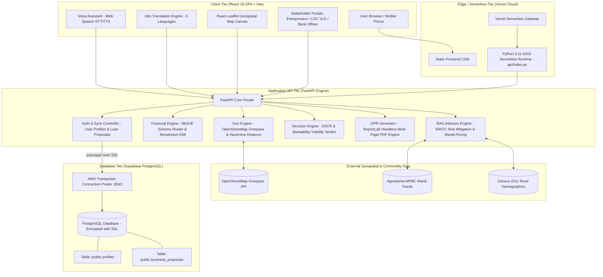

# 🏗️ GraminSahay AI — Complete Technical Architecture & System Specification

> **Project Reference:** SIH26091 | Ministry of Social Justice and Empowerment (MoSJE)  
> **Repository:** [https://github.com/palleti-muktej7/Graminsahay-AI.git](https://github.com/palleti-muktej7/Graminsahay-AI.git)  
> **Live Production URL:** [https://graminsahay-ai.vercel.app](https://graminsahay-ai.vercel.app)

---

## 📐 1. System Architecture Diagram



---

## 🗄️ 2. Database Architecture & Schema Specification

### 🔹 Database Engine:
* **Engine:** PostgreSQL 15 (Managed on Supabase Cloud)
* **Connection Routing:** AWS AP-South-1 Transaction Connection Pooler (`aws-0-ap-south-1.pooler.supabase.com:6543`)
* **Security & Encryption:** `sslmode=require` with TLS 1.3 encryption on all connections.

---

### 📋 Table 1: `public.profiles`
**Purpose:** Stores registered stakeholder identities, contact credentials, social categories for MoSJE concessional eligibility, and role access.

```sql
CREATE TABLE IF NOT EXISTS public.profiles (
    id UUID PRIMARY KEY DEFAULT gen_random_uuid(),
    full_name TEXT NOT NULL,
    phone TEXT NOT NULL UNIQUE,
    email TEXT,
    role TEXT NOT NULL DEFAULT 'entrepreneur',  -- 'entrepreneur', 'csc_vle', 'bank_officer'
    social_category TEXT DEFAULT 'OBC',        -- 'OBC', 'SC', 'ST', 'General'
    preferred_language TEXT DEFAULT 'en',     -- 'en', 'hi', 'ta', 'te', 'mr'
    created_at TIMESTAMP WITH TIME ZONE DEFAULT timezone('utc'::text, now())
);
```

#### What Information is Stored:
* `id`: Unique identifier (UUID).
* `full_name`: Entrepreneur, CSC VLE operator, or Bank Officer name.
* `phone`: 10-digit mobile number used for login and identity verification.
* `email`: Official email or auto-provisioned government portal email (`phone@graminsahay.gov.in`).
* `role`: Determines which dashboard and authorization permissions are granted upon login.
* `social_category`: Used to match specific statutory corporations (**NBCFDC** for OBC, **NSFDC** for SC, **NSTFDC** for ST).
* `preferred_language`: Preferred language (`en`, `hi`, `ta`, `te`, `mr`).

---

### 📋 Table 2: `public.business_proposals`
**Purpose:** Persists all generated loan feasibility proposals, geospatial catchment intelligence, financial cashflows, DSCR metrics, bank appraisals, and real-time sanction status.

```sql
CREATE TABLE IF NOT EXISTS public.business_proposals (
    id UUID PRIMARY KEY DEFAULT gen_random_uuid(),
    user_id UUID REFERENCES public.profiles(id) ON DELETE SET NULL,
    applicant_name TEXT NOT NULL,
    business_id TEXT NOT NULL,
    business_name TEXT NOT NULL,
    village TEXT NOT NULL,
    block TEXT,
    district TEXT NOT NULL,
    state TEXT NOT NULL,
    pincode TEXT,
    latitude DOUBLE PRECISION NOT NULL,
    longitude DOUBLE PRECISION NOT NULL,
    catchment_radius_km DOUBLE PRECISION DEFAULT 10.0,
    available_margin_capital DOUBLE PRECISION NOT NULL,   -- 10% Beneficiary Equity
    total_project_cost DOUBLE PRECISION NOT NULL,         -- 100% Outlay
    loan_amount DOUBLE PRECISION NOT NULL,                -- 90% Concessional Loan
    selected_scheme_id TEXT NOT NULL,                     -- 'mosje_micro_finance' or 'mosje_term_loan'
    selected_scheme_name TEXT NOT NULL,
    interest_rate_pct DOUBLE PRECISION NOT NULL,          -- 6.5% or 8.0% p.a.
    tenure_years INTEGER NOT NULL,                        -- 3 to 7 Years
    moratorium_months INTEGER NOT NULL,                   -- 3 to 6 Months
    regular_monthly_emi DOUBLE PRECISION NOT NULL,
    dscr DOUBLE PRECISION NOT NULL,                       -- Debt Service Coverage Ratio
    viability_verdict TEXT NOT NULL,                      -- 'GO', 'CAUTION', 'NO_GO'
    viability_score INTEGER NOT NULL,                     -- 0 to 100
    bankable_readiness_score INTEGER NOT NULL,            -- 0 to 100
    status TEXT DEFAULT 'PENDING',                        -- 'PENDING', 'SANCTIONED', 'CLARIFICATION', 'DECLINED'
    raw_response_json JSONB,                              -- Full structured JSON payload
    created_at TIMESTAMP WITH TIME ZONE DEFAULT timezone('utc'::text, now())
);
```

#### What Information is Stored:
* **Applicant & Location:** Name, village, block, district, state, pin, and exact GPS coordinates (lat/lon).
* **Capital & Scheme Structuring:** 10% own equity (margin), 100% total outlay, and 90% concessional loan amount.
* **Financial Calculations:** Concessional interest rate, tenure, moratorium grace period, monthly EMI, and DSCR.
* **Credit Decision:** GO / CAUTION / NO-GO verdict, bankable readiness %, and permanent bank officer sanction status.
* **Raw JSON Backup:** Complete snapshot of SWOT, competitor lists, pricing, and risk mitigations for one-click PDF re-generation.

---

## 💻 3. Complete Tech Stack Breakdown

### 🎨 Frontend Layer

| Technology | Where Used | Why Used | How Used |
|---|---|---|---|
| **React 18** | Complete User Interface | Component-based, responsive SPA with fast reactive rendering. | Manages state for 6 wizard steps, dashboard role switches, and live inputs. |
| **Vite** | Build Tool & Dev Server | Ultra-fast bundling, instant Hot Module Replacement (HMR). | Compiles JSX and Tailwind into optimized static assets in `/frontend/dist`. |
| **Tailwind CSS** | Styling & UI Design | Modern, responsive mobile-first utility classes. | Styled glassmorphism cards, dashboard rosters, alerts, and responsive grids. |
| **Lucide React** | Icons | Crisp, lightweight SVG icons. | Rendered step badges, status icons (`Landmark`, `Compass`, `ShieldCheck`, `CheckCircle`). |
| **React-Leaflet & Leaflet.js** | Step 3 Competitor Map | Interactive mobile-friendly map rendering without costly Google Maps API fees. | Renders OpenStreetMap tiles, center circle radius (5–10km), and competitor POI pins. |
| **Web Speech API** | Voice Assistant | Built-in browser speech recognition and vernacular voice synthesis. | `webkitSpeechRecognition` captures voice queries; `speechSynthesis` speaks audio responses in 5 languages. |
| **Axios** | HTTP API Client | Robust promise-based API communication with backend. | Auto-detects base URL (localhost vs. Vercel) and sends requests with timeout handling. |

---

### ⚙️ Backend Layer

| Technology | Where Used | Why Used | How Used |
|---|---|---|---|
| **Python 3.11** | Core Runtime | High-performance, robust standard library and async support. | Executes FastAPI serverless routes and financial calculations. |
| **FastAPI** | REST API Framework | Fastest Python framework with automatic Swagger docs and native async. | Houses all `/api/advisory/*`, `/api/report/*`, `/api/finance/*`, and `/api/auth/*` routes. |
| **Pydantic v2** | Data Validation & Schemas | Type-safe JSON request/response parsing. | Validates data schemas for proposals, entrepreneur profiles, and financial structures. |
| **Psycopg2-binary** | PostgreSQL Client | Industry standard PostgreSQL adapter for Python. | Executes connection pooling, SQL queries, and transactional updates to Supabase. |
| **HTTPX** | Async HTTP Client | Fast HTTP requests with strict timeouts. | Fetches live commercial POIs from OpenStreetMap Overpass API in `< 2.0s`. |
| **ReportLab** | PDF Generation Engine | High-precision programmatic multi-page PDF generation. | Generates official MoSJE Detailed Project Reports (DPRs) with tables, headers, and metadata on the fly. |

---

### ☁️ Infrastructure & Database Tier

| Technology | Where Used | Why Used | How Used |
|---|---|---|---|
| **Supabase PostgreSQL** | Cloud Database Tier | Relational persistence, high availability, and row-level security. | Stores user profiles and submitted loan proposals. |
| **Supabase Connection Pooler** | Cloud Connection Management | Bridges Vercel serverless IPv4 containers to PostgreSQL without connection limits. | Connects over port `6543` using transaction mode. |
| **Vercel Cloud** | Hosting & CI/CD | Automatic builds upon Git commit, zero-configuration edge deployments. | Runs frontend on CDN and backend via Python Serverless Function (`api/index.py`). |
| **OpenStreetMap & Overpass** | Hyper-Local GIS Data | Free, open-source geospatial dataset of commercial rural establishments. | Queries local retail and agricultural POIs within a 5–10km radius circle. |

---

## 🔄 4. End-to-End Data Flow Pipeline

```
1. User speaks or enters village & capital (e.g. "Dairy in Melattur, ₹1 Lakh")
                       ⬇
2. Frontend parses inputs & auto-selects business and 10% margin capital
                       ⬇
3. API evaluates Geo Market: Queries OpenStreetMap via Overpass for POIs within 10km
                       ⬇
4. API evaluates Financials: 
   - Total Cost = ₹1L ÷ 0.10 = ₹10 Lakh
   - Concessional Loan (90%) = ₹9 Lakh
   - Auto-routes to MoSJE Term Loan (8% p.a., 7 Yrs, 6-Mo Moratorium)
   - Monthly Moratorium Interest = ₹6,000/mo
   - Regular Monthly EMI = ₹14,032/mo
   - DSCR = Net Cashflow (₹30,000) ÷ EMI (₹14,032) = 2.14x (Viable)
                       ⬇
5. API evaluates RAG SWOT: Synthesizes evidence-based SWOT and Mandi prices in chosen language
                       ⬇
6. API synthesizes Decision Verdict: Score = 92/100 -> "GO" Verdict
                       ⬇
7. API asynchronously persists complete proposal to Supabase PostgreSQL (public.business_proposals)
                       ⬇
8. Frontend renders Step 1 to 6 in full native language with interactive Leaflet map
                       ⬇
9. Beneficiary downloads multi-page Bankable PDF DPR
                       ⬇
10. Bank Credit Officer logs in, reviews live proposal in database, and records "✓ Sanction"
```

---

## 🏆 5. Key Innovations & Differentiators

1. **Evidence-Grounded (Not Hallucinatory LLMs):**
   * Unlike generic chat bots that invent numbers, GraminSahay AI uses **deterministic financial formulas** (reducing-balance EMI, statutory interest subventions, DSCR) combined with **actual OpenStreetMap coordinates** and **Census demographic densities**.
2. **100% Policy-Compliant with MoSJE Corporations:**
   * Automatically aligns with **NBCFDC** (OBC), **NSFDC** (SC), and **NSTFDC** (ST) debt limits, 10% equity mandates, and principal moratorium periods.
3. **Inclusive Vernacular Kiosk Architecture:**
   * Full 5-language localization (**English, Hindi, Tamil, Telugu, Marathi**) plus **Voice Copilot** ensures illiterate or semi-literate rural citizens can articulate their business goals naturally.
4. **End-to-End Bank Integration:**
   * Closes the loop between rural entrepreneurs, CSC operators, and bank branch appraisal managers with persistent database workflows and printable appraisal reports.
